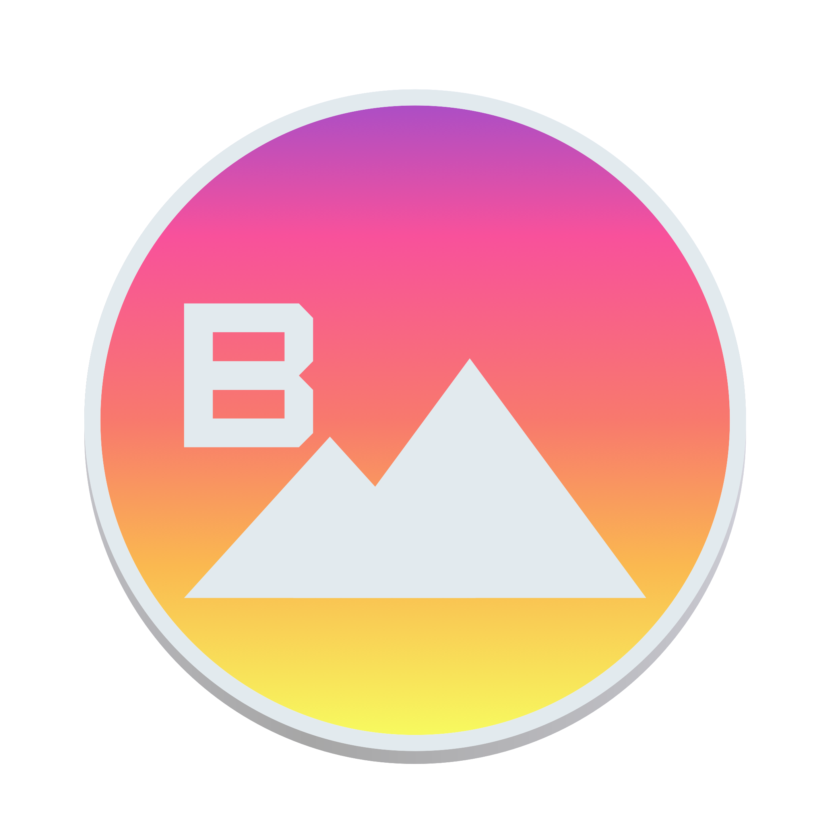

## Beengpaper

Beengpaper (pronounced *bingpaper*) is a small macOS menu bar
application that downloads the daily wallpaper from Bing and sets it on
all of your desktops.



> First (a little bit ugly) version of Beengpaper icon

### Installation 

Download the application here, open DMG file and drag and drop the app
into Applications folder.

### Building the app yourself

Beengpaper is written in Python (Python 3.7), using rumps and appscript
libraries. Additionally you need py2app to build the application
package.

```
git clone
cd beengpaper
python setup.py py2app
```

### FAQ
**Q. But why**

A. Because I got bored one sunday morning, and I like Bing wallpapers.
 
**Q. How can I make Beengpaper launch on startup?**

A. Unfortunately, Beengpaper cannot set itself as a launch program. You
can however easily make it launch on login using macOS Preferences pane.
Navigate to Preferences > Users and Groups > Login and add Beengpaper.


